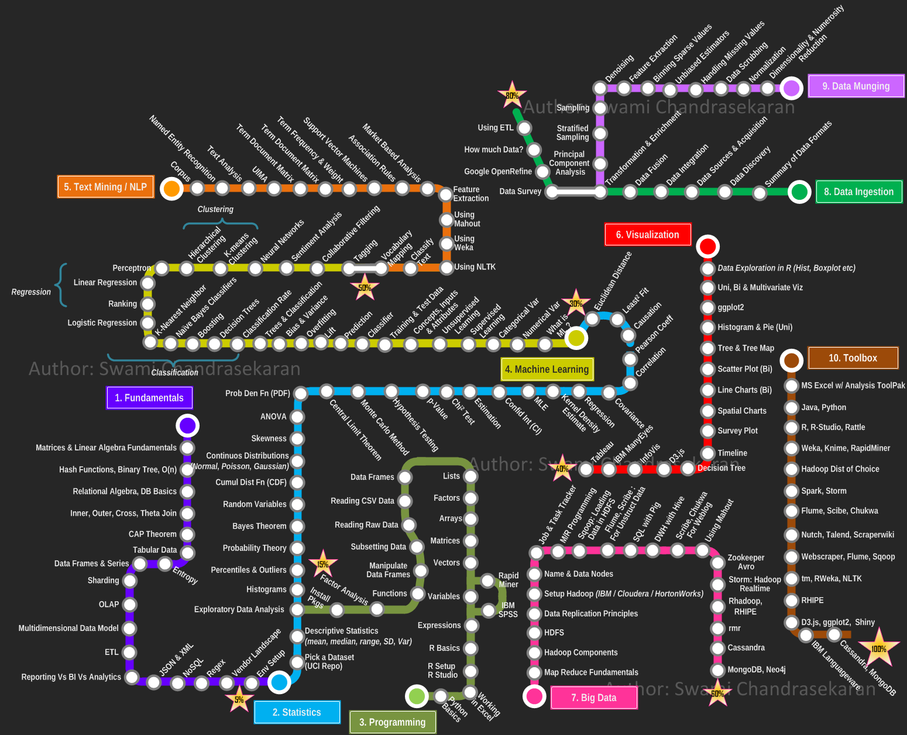

# __Python__ Science _"Pipeline"/"Flow"_

This document is created to link my personal files, and locate faster some resources, concepts, codes that I found inside the books in previous lectures. It tends to guide my AI team easy and faster to resources very spread on Internet.

The order here is important, is the way in which I see the process:

#### About _Science Pipelines_: [Python Data Sci Essentials, Chapter 3](2015_Boschetti_and_Massaron-Py_Data_Sci_Essentials.pdf)

#### About _Machine Learning_: [Practical Machine Learning](2018_Practical_ML_with_Py.pdf)

Contain the basics on ML. The second part is a broad description of ML pipeline. And the last part is well detailed (by chapter) exposition of Real World Case Studies.

#### [Machine Learning Glossary by Example](./general/ml_Gglossary_by_example.md), based on Google ML Glossary

## General Pipeline

- Collecting Data
- Data Munging & Wrangling
- Data Analysis/Exploring
    1. Feature Extraction
    2. Dimensionality Reduction
    3. [Outliers Treatment or Anomaly Detection](./data-preparation/outliers.md)
    4. Testing & Validation
    5. Feature Selection
    6. Data Plotting/Visualization
- Building Models
    1. [Hyper-param optimization](./modeling/hyperp_optimization.md)
    2. Model Evaluation
- [__Deploying Models into Apps__](2015_Sebastian_Raschka-Python_ML.pdf)
- Monitoring Models (Feedback)

## Data Engineering

 Visualization with _Altair_ notebook collection 
[Visualization with Vega and Altair](https://github.com/altair-viz/altair-tutorial.git)

 

https://www.analyticsvidhya.com/blog/2016/01/guide-data-exploration/
https://towardsdatascience.com/15-data-exploration-techniques-to-go-from-data-to-insights-93f66e6805df

## Model Engineering

* [NN From the ground up](https://www.youtube.com/watch?v=aircAruvnKk)

## ML Deployment

* [Amazon Cloud Free Services](https://aws.amazon.com/free/free-tier/)

## General Topics

### [Basic Knowledge](./general/basicknowledge.md)

### [DataSci Skills](./general/skills.md)

 

### [Corpus](./general/corpus.md)

### Applications - Products
- Text Classifier
- __Recommendation Systems__
    1. [Content & Collaborative Filtering](/2016_ML_for_the_web/ML_4the_Web.pdf)
    2. [Afinity Analysis: Apriori algthm](2015_Learning_Data_Mining_with_Py.pdf)
    3. [The million Song Dataset Example](2018_Practical_ML_with_Py.pdf)

### [Technologies](./general/techs.md)

### [Events](./general/events.md)

### [Certifications](./general/certifications.md)

### DataTypes

- Apache Parquet: A columnar data format.
- Apache Arrow: In memory columnar data format
- Graph DataBase Formats
- CSV
- [HDF5](/media/DATA/PyData/pyBooksData/01_Numpy/2019_Numerical_Python_2ndE.pdf)
- pandas.DataFrame

#### Interesting Links/Readings

- Models Deployment:
    1. [Model Deployment as a Service](/media/DATA/PyData/pyBooksData/04_ML/2018_Practical_ML_with_Py.pdf)
- Monitoring
    1. [Strategies to managing model robustness](/media/DATA/PyData/pyBooksData/04_ML/2016_Advanced_ML.pdf)

- [Google DeepMind Team](https://deepmind.com/)
- [Kaggle Blog](http://blog.kaggle.com) especialized on ML topics
- About [Netflix Recommendation System Algorithm](http://techblog.netflix.com/2012/04/netflix-recommendations-beyond-5-stars.html)
- How to find [DataSci Influencers](https://app.cronycle.com/discovery/topics/Data%20Science?activeTab=influencers)

## Future Readings

Applications of ML or future readings could be find in:
* [agriculture](./applications/agriculture.md)

- Fix this Lack of parallelization of LSTM
- Learning Long Term Dependency remains open
- [Attention concept](https://arxiv.org/abs/1409.0473)
- [Transformer NN Architecture](https://arxiv.org/abs/1706.03762)
- [BERT](https://arxiv.org/abs/1810.04805)
- Hierarchical Temporal Memory (HTM)
- Cascade Forests
- Capsule Networks (CapsNets),
- [Transfer Learning](https://ruder.io/transfer-learning/): he idea that the knowledge accumulated in a model trained for a
specific task—say, identifying flowers in a photo—can be transferred to
another model to assist in making predictions for a different, related
task
- [Radioactive Data](https://ai.facebook.com/blog/using-radioactive-data-to-detect-if-a-data-set-was-used-for-training/)
- [Advances in NLP, Report of December 25 2019](https://towardsdatascience.com/recent-advancements-in-nlp-2-2-df2ee75e189)

## Resources

* [Visualization of RNN, Attention, and others](https://jalammar.github.io/visualizing-neural-machine-translation-mechanics-of-seq2seq-models-with-attention/)
* [Building Transformers from scratch](https://github.com/keitakurita/Practical_NLP_in_PyTorch/blob/master/deep_dives/transformer_from_scratch.ipynb)
* [Library for using various transformers architectures](https://github.com/huggingface/transformers)
* [cheat sheets for AI, NN, ML, DL,, Big Data](https://becominghuman.ai/cheat-sheets-for-ai-neural-networks-machine-learning-deep-learning-big-data-678c51b4b463)
* [more cheat sheets](https://www.datasciencecentral.com/profiles/blogs/large-collection-of-neural-networks-ml-numpy-pandas-matplotlib-sc)
* [sorice NN notebook collection](https://github.com/sorice/tensorflow1.13)
